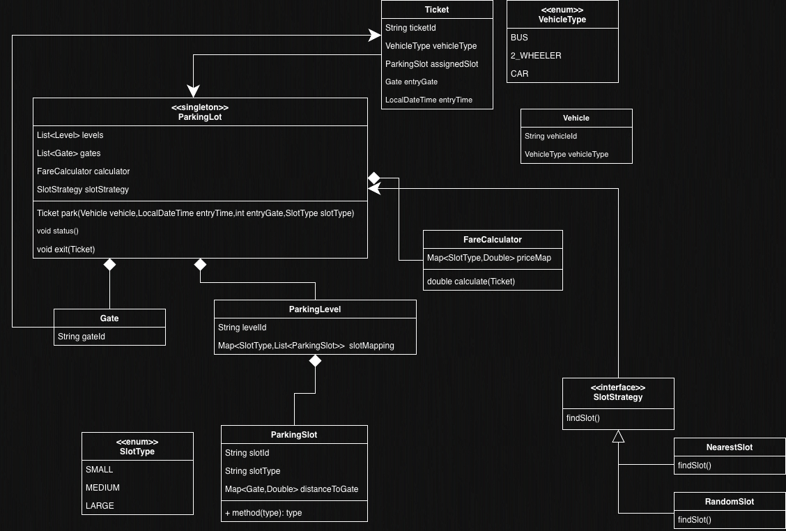

# Multi-Level Parking Lot — Low Level Design

A Java implementation of a multi-level parking lot system following SOLID principles and common design patterns.

## Design Patterns Used

- **Singleton** — `ParkingLot` is created via a `create()` factory method; only one instance exists.
- **Strategy** — `SlotStrategy` interface with `NearestSlot` (TreeSet-based) and `RandomSlot` implementations for flexible slot allocation.

## UML Diagram



## Project Structure

```
src/main/java/org/example/
├── Main.java                        # Demo driver
├── enums/
│   ├── SlotType.java                # SMALL, MEDIUM, LARGE
│   └── VehicleType.java             # BUS, TWO_WHEELER, CAR
├── model/
│   ├── Gate.java                    # Entry gate with gateId
│   ├── ParkingLevel.java            # Level with Map<SlotType, List<ParkingSlot>>
│   ├── ParkingSlot.java             # Slot with type, distances to gates, occupancy
│   ├── Ticket.java                  # Issued on park(), holds slot + vehicle + gate info
│   └── Vehicle.java                 # vehicleId + vehicleType
├── service/
│   ├── FareCalculator.java          # Hourly-rate fare calculation per SlotType
│   └── ParkingLot.java              # Singleton — park(), exit(), status()
└── strategy/
    ├── SlotStrategy.java            # Interface — findSlot()
    ├── NearestSlot.java             # TreeSet-based nearest slot to entry gate
    └── RandomSlot.java              # Random available slot selection
```

## Key Features

| Feature | Details |
|---|---|
| **Slot Types** | `SMALL` (2-wheelers), `MEDIUM` (cars), `LARGE` (buses) |
| **Nearest Slot** | Uses `TreeSet` sorted by distance-to-gate for O(n log n) optimized allocation |
| **Fare Calculation** | Ceil-based hourly charging with configurable per-slot-type rates |
| **Multi-Level** | Supports any number of levels, each with its own slot mapping |
| **Multi-Gate** | Each slot stores its distance to every gate for nearest-slot computation |

## How to Run

### Prerequisites

- Java 22+
- Maven 3.9+

### Compile & Run

```bash
# Clone the repository
git clone https://github.com/akshat-code21/multilevel_parking_lot_lld.git
cd multilevel_parking_lot_lld

# Compile
mvn compile

# Run the demo
mvn exec:java -Dexec.mainClass="org.example.Main"
```

### Run with just Java (no Maven exec plugin)

```bash
mvn compile
java -cp target/classes org.example.Main
```

## Sample Interaction

Running `Main.java` produces the following output:

```
======== PARKING LOT STATUS ========
Level: L1
  SMALL => Total: 2, Occupied: 0, Available: 2
    L1-S1 [AVAILABLE]
    L1-S2 [AVAILABLE]
  MEDIUM => Total: 2, Occupied: 0, Available: 2
    L1-M1 [AVAILABLE]
    L1-M2 [AVAILABLE]
  LARGE => Total: 1, Occupied: 0, Available: 1
    L1-L1 [AVAILABLE]
Level: L2
  SMALL => Total: 1, Occupied: 0, Available: 1
    L2-S1 [AVAILABLE]
  MEDIUM => Total: 1, Occupied: 0, Available: 1
    L2-M1 [AVAILABLE]
  LARGE => Total: 1, Occupied: 0, Available: 1
    L2-L1 [AVAILABLE]
====================================

Ticket issued: Ticket{ticketId='...', vehicleType=TWO_WHEELER, assignedSlot=ParkingSlot{slotId='L1-S1', slotType=SMALL, isOccupied=true}, entryGate=Gate{gateId='G0'}, entryTime=...}
Ticket issued: Ticket{ticketId='...', vehicleType=CAR, assignedSlot=ParkingSlot{slotId='L2-M1', slotType=MEDIUM, isOccupied=true}, entryGate=Gate{gateId='G1'}, entryTime=...}
Ticket issued: Ticket{ticketId='...', vehicleType=BUS, assignedSlot=ParkingSlot{slotId='L1-L1', slotType=LARGE, isOccupied=true}, entryGate=Gate{gateId='G0'}, entryTime=...}

--- After parking 3 vehicles ---
======== PARKING LOT STATUS ========
Level: L1
  SMALL => Total: 2, Occupied: 1, Available: 1
    L1-S1 [OCCUPIED]
    L1-S2 [AVAILABLE]
  MEDIUM => Total: 2, Occupied: 0, Available: 2
    L1-M1 [AVAILABLE]
    L1-M2 [AVAILABLE]
  LARGE => Total: 1, Occupied: 1, Available: 0
    L1-L1 [OCCUPIED]
Level: L2
  SMALL => Total: 1, Occupied: 0, Available: 1
    L2-S1 [AVAILABLE]
  MEDIUM => Total: 1, Occupied: 1, Available: 0
    L2-M1 [OCCUPIED]
  LARGE => Total: 1, Occupied: 0, Available: 1
    L2-L1 [AVAILABLE]
====================================

Vehicle CAR exiting. Fare: ₹60.0
Car fare for 3 hours: ₹60.0

--- After car exits ---
======== PARKING LOT STATUS ========
Level: L1
  SMALL => Total: 2, Occupied: 1, Available: 1
    L1-S1 [OCCUPIED]
    L1-S2 [AVAILABLE]
  MEDIUM => Total: 2, Occupied: 0, Available: 2
    L1-M1 [AVAILABLE]
    L1-M2 [AVAILABLE]
  LARGE => Total: 1, Occupied: 1, Available: 0
    L1-L1 [OCCUPIED]
Level: L2
  SMALL => Total: 1, Occupied: 0, Available: 1
    L2-S1 [AVAILABLE]
  MEDIUM => Total: 1, Occupied: 0, Available: 1
    L2-M1 [AVAILABLE]
  LARGE => Total: 1, Occupied: 0, Available: 1
    L2-L1 [AVAILABLE]
====================================
```

### What happens in the demo

1. A **2-level parking lot** is created with **2 entry gates** (G0, G1).
2. Each slot has a configured distance to each gate.
3. Three vehicles are parked using the **NearestSlot** strategy:
   - Bike at Gate 0 → gets `L1-S1` (nearest SMALL slot to G0, distance 5.0)
   - Car at Gate 1 → gets `L2-M1` (nearest MEDIUM slot to G1, distance 5.0)
   - Bus at Gate 0 → gets `L1-L1` (nearest LARGE slot to G0, distance 7.0)
4. The car exits after 3 hours → fare = 3 × ₹20/hr = **₹60.0**
5. Status is printed at each step showing occupancy changes.
